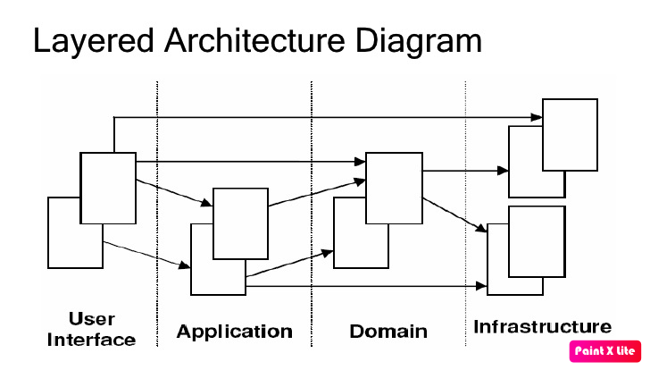

Crossword game
=======
[](https://github.com/dykyi-roman/crossword/blob/master/LICENSE)
[](https://php.net/)

# DDD

Domain-driven design is not a technology or a methodology. 
It is a way of thinking and a set of priorities, aimed at accelerating software projects that have to deal with complicated domains.

On a macro level using DDD concepts like Ubiquitous Language and Bounded Contexts can solve complex perspectives on data in to smaller models and clear data ownership.
Follow practices splitting the source code based on bounded contexts we define a next context:

 * `Crossword`
 * `Dictionary`
 * `Game`

For reducing duplication of code we use a `SharedKernel`, it helps share a common code between context.  
 
# Layered Architecture

To make the code organised each context uses Layered Architecture and each functional area is divided on four layers:

 * `Application`
 * `Doman`
 * `Infrastructure`
 * `UI`
 


:+1: Checked by [Deptrac](https://github.com/qossmic/deptrac)
 
# Docker

The docker-compose up command aggregates and run each container.

``
 docker network create game
 make start
`` 

# Swagger

Swagger help to describe the structure of APIs for better understand how is it works.

``URL: /swagger``
___


# Postman

Сollections with queries can be found: ``cd /postman``

:+1: Checked by [Newman](https://github.com/postmanlabs/newman)

# Dictionary

### Rest Api

| Path                                         | Method | Scheme | Grant |
| -------------------------------------------  | -------| ------ | ----- |
| /dictionary/languages                        | GET    | ANY    | ALL   |
| /dictionary/words/{LANGUAGE}/word?mask={MASK}| GET    | ANY    | ALL   |

#### Response formats

 * `json`
 * `xml`

### Commands

Used to fill a dictionary:

```
php bin/console crossword:dictionary:words-storage-populate {LANGUAGE-CODE}
```

Collections with words for populate can be found: ``cd /data``

# Crossword

# Game

## Stack

* PHP 8.0
* Symfony 5.2
* Elasticsearch
* RabbitMQ
* Redis
* SQLite
 
## Clean code support packages
* phpunit
* phpcs
* psalm
* rector
* phpcs-calisthenics-rules
* newman
* deptrac

## Author
[Dykyi Roman](https://www.linkedin.com/in/roman-dykyi-43428543/), e-mail: [mr.dukuy@gmail.com](mailto:mr.dukuy@gmail.com)
